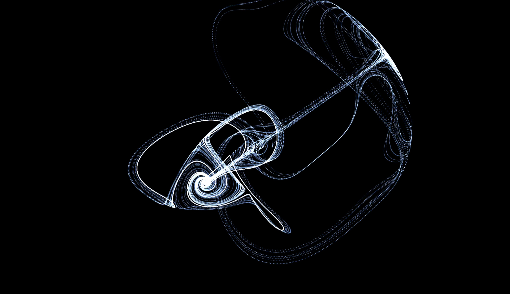

# 🚀 3D Gaussian Thomas Attractor

カオス理論の **Thomas' cyclically symmetric attractor（トーマス・アトラクター）** を、
TypeScript + Three.js で **3D Gaussian Splatting 風**に描画するアートプロジェクト。

「計算」と「描画」を最初から分離せず、**1つの環境（ブラウザ）で完結させ、徐々に自作パートを増やす**戦略で進める。本書はその進行ガイド（Steering File）。



---

## 🛠️ Tech Stack

- **言語:** TypeScript
- **描画:** [Three.js](https://threejs.org/)（`three` + `@types/three`）
- **ビルド:** [Vite](https://ja.vite.dev/)
- **描画手法:** Points + カスタム GLSL Shader（Gaussian Splat 風） + Additive Blending
- **ポストプロセス:** EffectComposer（Bloom / FilmPass）

---

## 📅 フェーズ 1: 【1日目】最小構成で「動く感動」を味わう

**ゴール:** ブラウザ上にアトラクターの形（数万個の点）を3Dで出現させ、マウスで回転できるようにする。

### 1. 開発環境の準備

- Vite で TypeScript 環境を立ち上げる（または CodeSandbox 等のオンラインエディタ）。
- 依存ライブラリ `three` と型定義 `@types/three` をインストールする。

### 2. 数式（シミュレーション）の実装

以下のパラメータと微分方程式（オイラー法）で、ループ文で数万個の座標 $(x, y, z)$ を計算し配列に格納する。

**パラメータ:**

- $b = 0.1992$
- $dt = 0.05$
- 初期値: $(x, y, z) = (0.1,\ 0.0,\ 0.0)$ ※すべて0にすると動かないため僅かにずらす

**毎ステップの計算式:**

- $x_{\text{new}} = x + (\sin(y) - b \cdot x) \cdot dt$
- $y_{\text{new}} = y + (\sin(z) - b \cdot y) \cdot dt$
- $z_{\text{new}} = z + (\sin(x) - b \cdot z) \cdot dt$

### 3. 標準機能での描画

- 計算した座標配列を Three.js の `BufferGeometry` の位置属性（position）へ流し込む。
- マテリアルはまず標準の `PointsMaterial`（シンプルな四角いドット）を使用。
- `OrbitControls` を追加し、カメラをマウスでグリグリ回せるようにする。

> ✅ **1日目のチェックポイント**
> 画面に不思議な「ドーナツが絡み合ったような3Dの形」がドットで表示され、自由に回転できれば大成功。

---

## 📅 フェーズ 2: 【2日目】「光の質感」を自作する（シェーダーへの挑戦）

**ゴール:** 無機質なドットを、中心が発光し外側がボケる半透明の球体（ガウシアン・スプラット）に変貌させる。

### 1. マテリアルのアップグレード

- `PointsMaterial` を廃止し、独自プログラムを書ける `ShaderMaterial` に変更する。

### 2. カスタムシェーダー（GLSL）の執筆

- **頂点シェーダー (Vertex Shader):**
  - 3D座標を画面の2D座標に変換する。
  - `gl_PointSize` を設定し、1点を画面上で数十ピクセル四方の「四角い領域」に広げる。
- **フラグメントシェーダー (Fragment Shader):**
  - 四角い領域内で、中心からの距離（半径 $r$）を計算する。
  - **ガウス関数 $e^{-r^2}$** で、中心が最も明るく（不透明度1）外側へなだらかに透明（不透明度0）になるようアルファ値を決める。

### 3. ブレンドモードの変更

- レンダラー設定でマテリアルの `blending` を `AdditiveBlending`（加算合成）に設定する。
- 点と点が重なる高密度な場所が強く発光し、「眩しい光のレイヤー」が生まれる。

---

## 📅 フェーズ 3: 【3日目〜】密度とポストプロセスの調整（クオリティアップ）

**ゴール:** 粒子数を増やし、カラーマッピングとザラザラした質感（ディザリング）で完成度を極める。

### 1. カラーマッピング（Color Mapping）

- 密度の高い部分（または中央付近）が白〜ピンク、外側へ向かって紫〜青に変化するグラデーションをシェーダー内で実装する。

### 2. ポストプロセス（後処理）

- `EffectComposer` を導入する。
- **Bloom（残光）:** 光っている部分をさらにボワッと幻想的に輝かせる。
- **FilmPass（ノイズ）:** 画面全体に微細なフィルムノイズを乗せ、CGっぽさを消して映画的でオーガニックなザラザラ感を演出する。

## フェーズ4以降のアイデア

- **インタラクティブ化:** マウスやタッチでアトラクターのパラメータをリアルタイムに変更できるようにする。
- **音楽との連動:** 音の周波数や振幅に応じてアトラクターの形状や色が変化するビジュアライザーに発展させる。
- **VR/AR対応:** WebXR を使って、VRヘッドセットやスマホのARモードでアトラクターの中に入り込む体験を提供する。
- **物理シミュレーション:** より複雑なカオス系や流体シミュレーションを取り入れて、さらに多様な形状や動きを表現する。
- **データビジュアライゼーション:** 実世界のデータ（株価、気象データ、SNSのトレンドなど）をカオス的な動きで表現するアート作品に応用する。
- アトラクターが時間とともに進化するアニメーションを追加し、ループ再生できるようにする。

---

## ⚠️ トラブルシューティング

- **パフォーマンスの限界:**
  JS の CPU 処理で数億回ループするとブラウザが確実にフリーズする。
  フェーズ1〜2では粒子数を **5万〜10万個** 程度に抑える。
- **形状の崩壊:**
  微分方程式の `dt` が大きすぎるとカオスの軌跡が壊れて無限に発散する。
  必ず `0.05` 以下の小さな値で検証すること。

---

## 🏁 セットアップ（予定）

```bash
# 週末に実行する想定
npm create vite@latest . -- --template vanilla-ts
npm install three @types/three
npm run dev
```

## 📌 進捗

- [x] フェーズ1: 点群表示 + OrbitControls
- [x] フェーズ2: Gaussian Splat シェーダー + Additive Blending
- [ ] フェーズ3: カラーマッピング + Bloom + FilmPass

## 📚 参考URL

https://www.instagram.com/reel/DYsSz2rvWGI
